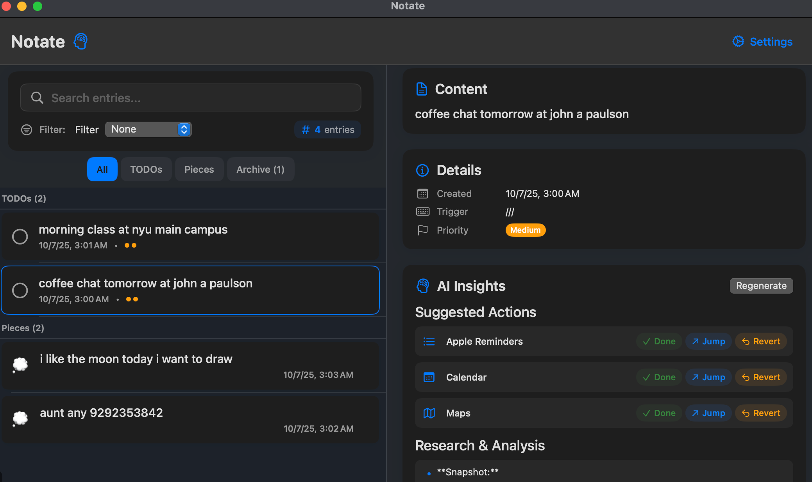
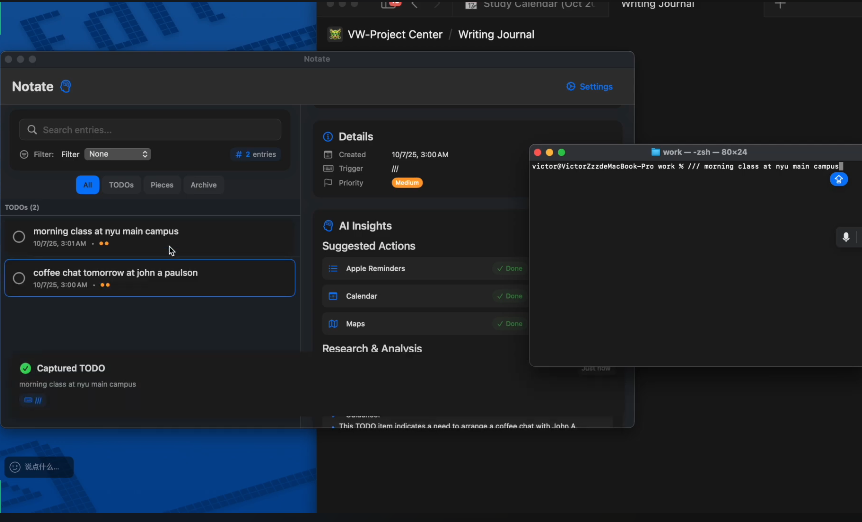
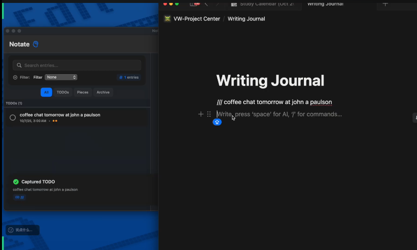

# Notate - Smart TODO Capture App

A lightweight, cross-app capture tool that listens for custom triggers, instantly records snippets (TODOs or Thoughts/Ideas), clears the text from the current input box to avoid accidental sending, and persists everything to a searchable database.

## Motivation

We take notes everywhere—macOS Stickies, Apple Notes, WeChat file transfer chats, even random comment boxes. Sometimes it is an urgent errand, sometimes a phone number, often a stray idea. Everything ends up messy and scattered, and the important pieces get lost because we forget to review them later.

## Product Overview

### Vision

Notate is a simple, AI-native capture companion that lets us keep typing in any app while the system quietly organizes those snippets into a single, reviewable home.

### Capture Flow

Whenever typing starts with a unique identifier and ends with the same identifier—`!! buy milk !!`, `AAA call mom AAA`, `/// draft blog`—Notate treats the enclosed text as a capture. The default delimiter is `!!`, and you can swap in anything that fits your muscle memory. The capture engine scoops the content, clears it from the source field to prevent accidental sends, tags it with metadata (app, trigger, time), and stores it in the encrypted SQLite database.

### Why AI-Native

Claude Sonnet 4.5 handles the heavy lifting once an entry lands: structured extraction for contacts, times, and action intents; research briefs that add context; and autonomous tool calls that spawn reminders, calendar events, or map lookups when the data calls for it.

## Demo

<p align="center">
  
  
  
</p>

## Features Implemented

### ✅ 1. Customizable Start Trigger
- **Multiple triggers supported**: `///`, `,,,`, `;;`, etc.
- **Configurable in Settings**: Add, edit, remove triggers
- **Type mapping**: Each trigger can map to a default entry type (TODO/Thought)
- **Multilingual support**: English & Chinese characters in triggers

### ✅ 2. Input Capture & Auto-Clear
- **Smart capture**: Detects trigger + content, saves on Enter
- **Auto-clear input**: Clears current writing area to prevent accidental sending
- **Non-blocking UX**: ≤50ms perceived performance
- **Cross-app compatibility**: Works in WhatsApp, WeChat, Slack, etc.

### ✅ 3. Persistent Storage (SQLite Database)
- **CRUD operations**: Create, read, update, delete entries
- **UTF-8 safe**: No Chinese encoding issues
- **Encryption at rest**: Uses CryptoKit for key management
- **Export ready**: JSON/CSV export for future sync
- **Search & filter**: Full-text search across content and tags

### ✅ 4. Multilingual Support (Chinese/English)
- **CJK input handling**: Proper IME composing state detection
- **No mojibake**: Clean UTF-8 storage and display
- **Mixed language support**: English and Chinese in same entry

### ✅ 5. Two Input Types: TODO vs Thoughts
- **TODO entries**: Actionable, trackable tasks with status and priority
- **Thought entries**: Non-actionable notes/insights
- **Smart type detection**:
  - **Trigger mapping**: `///` → TODO, `,,,` → Thought
  - **Inline overrides**: `todo:`, `t:`, `待办:` → TODO; `idea:`, `i:`, `想法:` → Thought
  - **Priority**: Inline override > Trigger mapping

### ✅ 6. Rich UI Experience
- **Tabbed interface**: All · TODOs · Thoughts
- **Task list view**: TODOs with checkboxes, status, priority
- **Card view**: Thoughts in grid layout
- **Search & filter**: Real-time search and filtering
- **Swipe actions**: Quick mark done, delete, convert
- **Convert functionality**: Thought → TODO with metadata preservation

### ✅ 7. Security & Privacy
- **Encryption at rest**: Symmetric key encryption for database
- **Keychain integration**: Secure key storage
- **Redaction mode**: Blur content for screenshots/demos
- **Local-only**: No cloud sync (ready for future implementation)

## Usage Examples

### Basic Capture
```
/// buy milk                    → TODO: "buy milk"
/// 做作业                      → TODO: "做作业"
,,, idea: link shopping list   → Thought: "link shopping list"
,,, 想法：把购物清单和地理位置联动 → Thought: "把购物清单和地理位置联动"
```

### Inline Type Overrides
```
;; t: book dentist             → TODO: "book dentist" (force TODO)
;; i: 观察：周一早上最容易分心    → Thought: "观察：周一早上最容易分心" (force Thought)
```

### Trigger Configuration
- **Default triggers**: `///` (TODO), `,,,` (Thought), `;;` (TODO)
- **Customizable**: Add your own triggers in Settings
- **Type mapping**: Each trigger can have a default type
- **Enable/disable**: Toggle triggers on/off

## Technical Architecture

### Core Components
- **CaptureEngine**: Global key event monitoring and trigger detection
- **DatabaseManager**: SQLite operations with encryption
- **ConfigurationManager**: Trigger and app settings management
- **AppState**: Main state management with Combine

### Data Model
```swift
struct Entry {
    let id: String
    let type: EntryType          // .todo | .thought
    var content: String
    var tags: [String]
    var sourceApp: String?
    var triggerUsed: String
    let createdAt: Date
    var status: EntryStatus      // .open | .done (TODO only)
    var priority: EntryPriority? // .low | .medium | .high (TODO only)
    var metadata: [String: FlexibleCodable]?
}
```

### Database Schema
- **entries table**: All captured entries with full metadata
- **Indexes**: Optimized for type, date, status, priority queries
- **Encryption**: AES-256 encryption for sensitive data
- **Export**: JSON/CSV export functionality

## Installation & Setup

1. **Clone the repository**
2. **Open in Xcode**: `Notate.xcodeproj`
3. **Build and run**: The app will request accessibility permissions
4. **Grant permissions**: System Settings > Privacy & Security > Accessibility
5. **Start capturing**: Type `///` or `,,,` followed by your content

## Configuration

### Trigger Setup
1. Open Settings in the app
2. Add custom triggers (e.g., `;;`, `!!!`, `>>>`)
3. Set default type for each trigger
4. Enable/disable triggers as needed

### Capture Settings
- **Auto-clear input**: Automatically clear input after capture
- **Capture timeout**: How long to wait before auto-capturing (1-10 seconds)
- **IME support**: Enable Chinese/Japanese/Korean input method support

## Privacy & Security

- **Local storage**: All data stays on your device
- **Encrypted database**: AES-256 encryption for data at rest
- **Keychain integration**: Secure key management
- **No telemetry**: No data collection or analytics
- **Export control**: Full data export for backup/migration

## Future Enhancements

- **Cloud sync**: Optional iCloud/other cloud provider sync
- **Advanced filtering**: Date ranges, complex tag queries
- **Keyboard shortcuts**: Global shortcuts for quick capture
- **Widgets**: macOS widget for quick access
- **Themes**: Dark/light mode customization
- **Plugins**: Extensible trigger and processing system

## Troubleshooting

### Common Issues
1. **No capture detected**: Check accessibility permissions
2. **Chinese input issues**: Enable IME composing support in settings
3. **Database errors**: Check Application Support folder permissions
4. **Trigger conflicts**: Ensure triggers don't overlap

### Debug Mode
- Check Console.app for debug logs
- Look for "Notate" entries in system logs
- Verify accessibility permissions in System Settings

## License

This project is licensed under the MIT License - see the LICENSE file for details.

## Contributing

1. Fork the repository
2. Create a feature branch
3. Make your changes
4. Add tests if applicable
5. Submit a pull request

## Support

For issues and feature requests, please use the GitHub Issues page.
